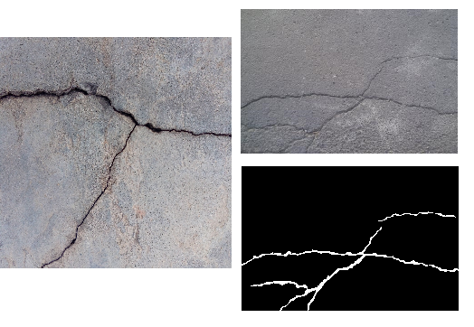
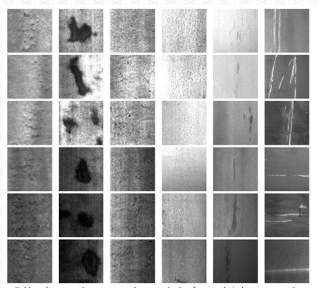
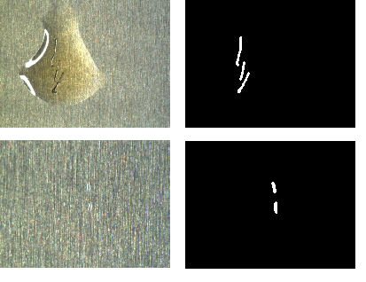
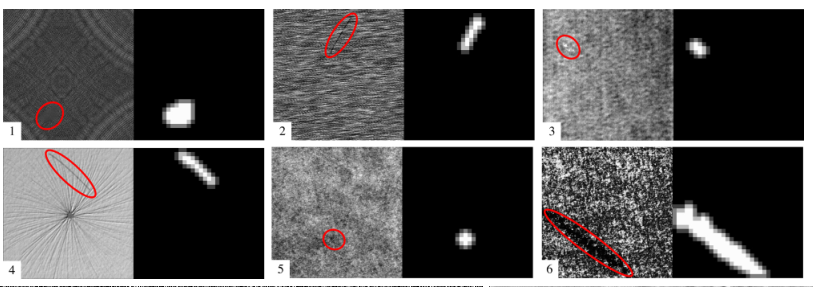
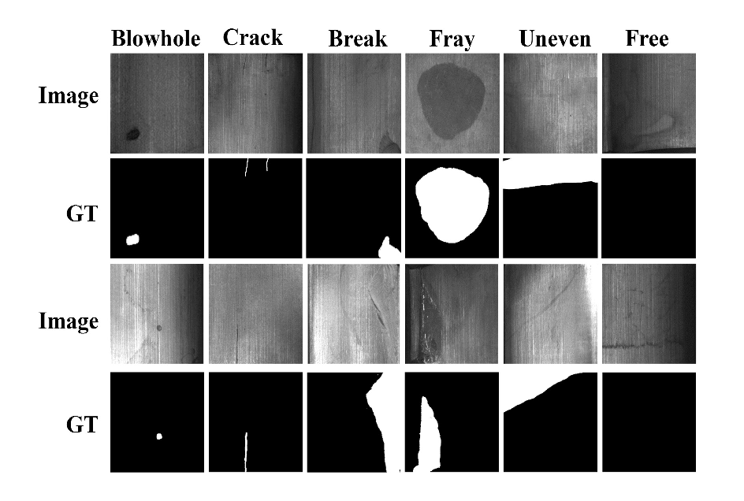

Researchers of surface defect often suffer from the lack of the corresponding dataset.  
Thanks to the data provider's generous support, we can collect these datasets. 

You can download some of these datasets which are modified by us, they are in the zip files in this project. Others datasets you can visit the links we provide.

**The image datasets are only for academic research, no commercial purposes are allowed. If you use any datasets, please cite the paper of the corresponding  provider!!!**

There are several different surfaces, each surface contains one or several defects. For image segmentation, object detection, saliency detection, classification, etc.

**The image datasets are:**

----------
# Cracks on the surface of the construction. #

Cracks on the bridge(left) and crack on the road surface.

-  Bridge cracks. There are 2688 images of bridge crack without pixel-level ground truth. From the authors "Liangfu Li Weifei Ma  Li Li Xiaoxiao Gao".  Files can be reached by visiting [https://github.com/maweifei/Bridge_Crack_Image_Data](https://github.com/maweifei/Bridge_Crack_Image_Data).

-  Crack on road surface. From Shi, Yong, and Cui, Limeng and Qi, Zhiquan and Meng, Fan and Chen, Zhensong. Original dataset can be reached at [https://github.com/cuilimeng/CrackForest-dataset](https://github.com/cuilimeng/CrackForest-dataset). **We extract the image files of the pixel level ground truth.**

-----------

# Steel surface defects #

These Datasets from Kechen Song, Northeastern University (NEU). You can visit they Homepage [http://faculty.neu.edu.cn/me/songkc/Vision-based_SIS_Steel.html](http://faculty.neu.edu.cn/me/songkc/Vision-based_SIS_Steel.html) to download 1800 images.

- There are something wrong with the original website of this dataset now(2019-03-20). There is a pdf file named "NEU_surface_defect.pdf" in this repo, and google drive link of this dataset is given in the pdf f
examples of the figure below:

- these 6 class NEU surface defect dataset has only the image level label, no pixel level Ground truth.
ile. 

- Their "Micro surface defect database" and "Oil pollution defect database" are labeled with pixel level **ground truth by us**. You can clone this repo and download these file.

-------
# Weakly Supervised Learning for Industrial Optical Inspection #
You can download these 10 datasets by visit [https://hci.iwr.uni-heidelberg.de/node/3616](https://hci.iwr.uni-heidelberg.de/node/3616)
Samples like the figure below:

# Magnetic tile dataset #
----
And the magnetic tile dataset by ourselves. Can be downloaded from [https://github.com/abin24/Magnetic-tile-defect-datasets.](https://github.com/abin24/Magnetic-tile-defect-datasets.)

**If you have any difficulty to access these datasets,** contact me by [huangyibin2014@ia.ac.cn](huangyibin2014@ia.ac.cn)

